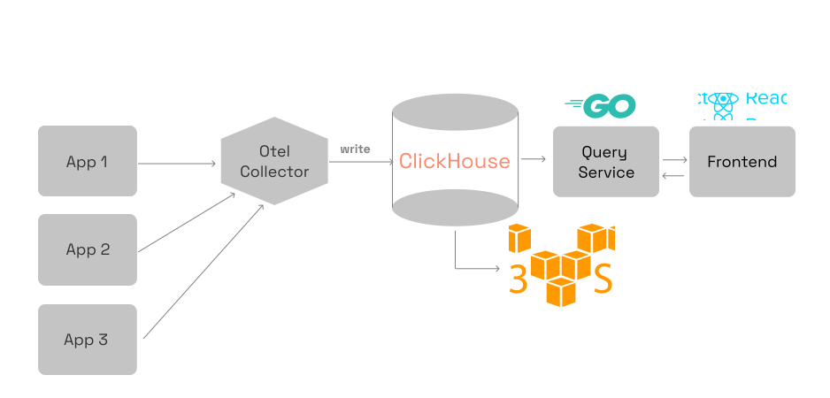

SigNoz is an open-source application performance monitoring tool that helps you monitor your applications and troubleshoot problems. SigNoz uses distributed tracing to gain visibility into your software stack.

With SigNoz, you can do the following:

- Monitor application metrics such as latency, requests per second, error rates
- Monitor infrastructure metrics such as CPU utilization or memory usage
- Track user requests across services
- Set alerts on metrics
- Find the root cause of the problem by going to the exact traces which are causing the problem
- See detailed flame graphs of individual request traces

## How Does SigNoz Work?

<!-- Is this accurate? Do we want to add more details? -->

SigNoz collects data using [OpenTelemetry](https://opentelemetry.io/), an open-source observability solution. Therefore, SigNoz supports all the frameworks and languages supported by OpenTelemetry. You can find the complete list of supported languages on the [Instrumentation](https://opentelemetry.io/docs/instrumentation/) page of the OpenTelemetry documentation.

Then, SigNoz aggregates all the collected data, and you use the dashboard to see all the metrics and traces related to your application.

### Architecture

SigNoz includes the following components:
- **OpenTelemetry Collector**: Collects telemetry data from your services and applications.
- **ClickHouse**: An open-source, high performance columnar OLAP database management system. 
- **Query Service**: The interface between the front-end and ClickHouse
- **Frontend**: The user interface, built in ReactJS and TypeScript.

To learn more about the architecture of SigNoz, see the [Architecture](/docs/architecture) page.

## Get Started

Perform the following steps to get started with SigNoz and instrument your first application:

  <article class="col col--6">
    <a class="card margin-bottom--lg padding--lg cardContainer_node_modules-@docusaurus-theme-classic-lib-next-theme-DocCard-styles-module cardContainerLink_node_modules-@docusaurus-theme-classic-lib-next-theme-DocCard-styles-module" href="/docs/install/">
      <h2 class="text--truncate cardTitle_node_modules-@docusaurus-theme-classic-lib-next-theme-DocCard-styles-module" title="1. Install SigNoz">1. Install SigNoz</h2>
      
Learn how to install SigNoz

    </a>
  </article>
  <article class="col col--6">
    <a class="card margin-bottom--lg padding--lg cardContainer_node_modules-@docusaurus-theme-classic-lib-next-theme-DocCard-styles-module cardContainerLink_node_modules-@docusaurus-theme-classic-lib-next-theme-DocCard-styles-module" href="/docs/instrumentation/overview/">
      <h2 class="text--truncate cardTitle_node_modules-@docusaurus-theme-classic-lib-next-theme-DocCard-styles-module" title="2. Instrument Applications">2. Instrument Applications</h2>
      
Learn how to instrument your application

    </a>
  </article>

## Use SigNoz

The topics in this section provide details on using SigNoz to monitor your application.

  <article class="col col--6">
    <a class="card margin-bottom--lg padding--lg cardContainer_node_modules-@docusaurus-theme-classic-lib-next-theme-DocCard-styles-module cardContainerLink_node_modules-@docusaurus-theme-classic-lib-next-theme-DocCard-styles-module" href="/docs/userguide/overview/">
      <h2 class="text--truncate cardTitle_node_modules-@docusaurus-theme-classic-lib-next-theme-DocCard-styles-module" title="1. User Guides">1. User Guides</h2>
      
Create dashboards,set alerts, and perform other tasks

    </a>
  </article>
  <article class="col col--6">
    <a class="card margin-bottom--lg padding--lg cardContainer_node_modules-@docusaurus-theme-classic-lib-next-theme-DocCard-styles-module cardContainerLink_node_modules-@docusaurus-theme-classic-lib-next-theme-DocCard-styles-module" href="/docs/tutorials">
      <h2 class="text--truncate cardTitle_node_modules-@docusaurus-theme-classic-lib-next-theme-DocCard-styles-module" title="2. Tutorials">2. Tutorials</h2>
      
Tutorials about monitoring your applications and infrastructure

    </a>
  </article>
  <article class="col col--6">
    <a class="card margin-bottom--lg padding--lg cardContainer_node_modules-@docusaurus-theme-classic-lib-next-theme-DocCard-styles-module cardContainerLink_node_modules-@docusaurus-theme-classic-lib-next-theme-DocCard-styles-module" href="/docs/operate">
      <h2 class="text--truncate cardTitle_node_modules-@docusaurus-theme-classic-lib-next-theme-DocCard-styles-module" title="3. Operate">3. Operate</h2>
      
This section explains how to manage SigNoz

    </a>
  </article>

