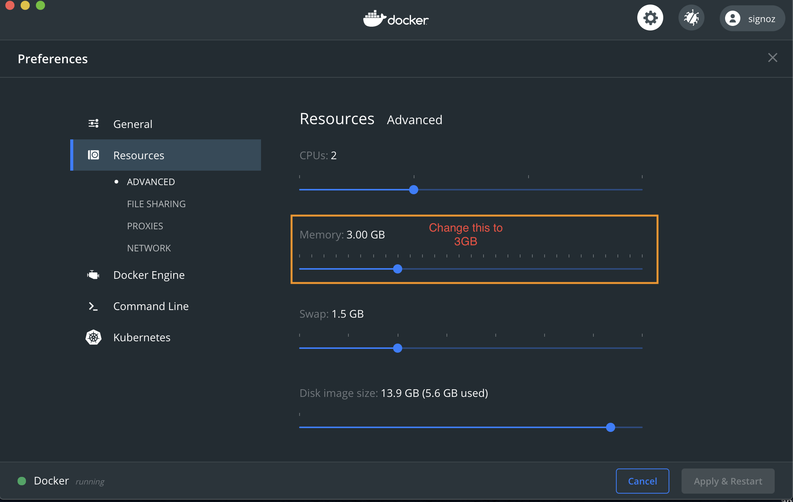

### Generic Docker Installation Tutorial
1. Install [Docker Engine](https://docs.docker.com/engine/install/ubuntu)
2. Then install [Docker Compose](https://docs.docker.com/compose/install/)
3. [Setup Docker to run without root privileges](https://docs.docker.com/engine/install/linux-postinstall/#manage-docker-as-a-non-root-user) (optional but strongly recommended)
4. Install `git`:
```console
sudo apt-get update && sudo apt-get install git
```
5. To clone the SigNoz repository and enter the new directory, run:
```console
git clone https://github.com/SigNoz/signoz.git && cd signoz/deploy/docker
```
6. **To run SigNoz**:

We have a tiny instance setting which runs with **3GB of memory**. This is just for demo/testing purpose and not to be used in production


1. Choose the Docker menu whale menu > Preferences from the menu bar and configure the runtime options described below.


2. Choose Resources from Preferences Menu and change Memory to 3GB




Below command will bring up SigNoz services
```console
docker-compose -f docker-compose-tiny.yaml up -d
```
A standard instance of SigNoz needs around **8GB of memory**. Below command will bring up a standard instance.
```console
docker-compose up -d
```
7. The UI should be accessible at port 3000 on the domain you set up or the IP of your instance.

:::info
Wait for 2-3 mins for the data to be available to frontend. If you are running on local machine, checkout `http://localhost:3000`
:::


### Troubleshooting
1. `docker ps` will show all containers created by SigNoz. Check if `broker` and `historical` containers are running. They do not come up if there is a memory problem.
2. Try re-running `docker-compose -f docker-compose-tiny.yaml up -d`, this will retry installing containers which failed the first time.
3. Open `http://localhost:8888` (This is druid console) and check if **Datasource** named `flattened_spans` has come up. If there is no **Ingestion Supervsor** running, then run `docker-compose -f docker-compose-tiny.yaml up -d create-supervisor set-retention`
4. If you couldn't spot issues, feel free to join our slack community or shoot an email at ankit@signoz.io. We are generally always there. 

### Configure docker-compose.yml
The current `docker-compose.yaml` includes sample application ([HotR.O.D](https://github.com/jaegertracing/jaeger/tree/master/examples/hotrod)) that generates tracing data.

### How to instrument your own applications
[Checkout Instrumentation Section](/docs/instrumentation/python)