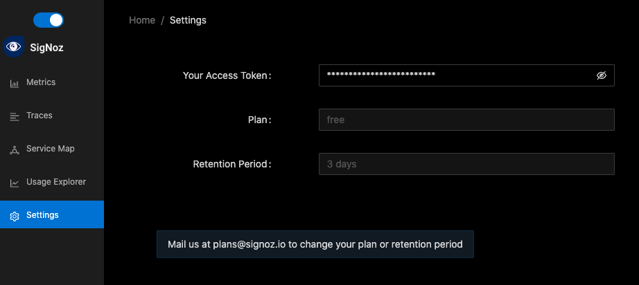

import Tabs from "@theme/Tabs";
import TabItem from "@theme/TabItem";

**Requirements**

- Node.js version 12 or newer
- An app to add OpenTelemetry to

To install OpenTelemetry, we recommend [LightStep's handy OTel-Launcher](https://github.com/lightstep/otel-launcher-node), which simplifies the process.

```bash
npm install lightstep-opentelemetry-launcher-node --save
```

We shall use OTLP HTTP exporter to send data to SigNoz

Once you've downloaded the launcher, you can run OpenTelemetry using the following basic configuration.

```bash
const { lightstep, opentelemetry } = require('lightstep-opentelemetry-launcher-node');

const sdk = lightstep.configureOpenTelemetry();

sdk.start().then(() => {
  // All of your application code and any imports that should leverage
  // OpenTelemetry automatic instrumentation must go here.
});
```

#### Run Command


<Tabs
  defaultValue="self-hosted"
  groupId="hosting-options-node"
  values={[
    { label: "Self Hosted", value: "self-hosted" },
    { label: "Cloud", value: "cloud" },
  ]}
>
  <TabItem value="self-hosted">


```bash
OTEL_EXPORTER_OTLP_SPAN_ENDPOINT="http://<IP of SigNoz Backend>:55681/v1/trace" LS_SERVICE_NAME=<service name> npm start
```

</TabItem>
  <TabItem value="cloud">

```bash
OTEL_EXPORTER_OTLP_SPAN_ENDPOINT="https://ingest.signoz.io:55681/v1/trace" LS_SERVICE_NAME=<App Name> LS_ACCESS_TOKEN=<access_token> npm start
```
You will find the access token in your settings page as shown in below image



</TabItem>

</Tabs>


### Troubleshooting your installation

Set an environment variable to run the OpenTelemetry launcher in debug mode, where it logs details about the configuration and emitted spans:

```bash
export OTEL_LOG_LEVEL=debug
```

The output may be very verbose with some benign errors. Early in the console output, look for logs about the configuration and check that your access token is correct. Next, look for lines like the ones below, which are emitted when spans are emitted to SigNoz.

```bash
{
  "traceId": "985b66d592a1299f7d12ebca56ca1fe3",
  "parentId": "8d62a70aa335a227",
  "name": "bar",
  "id": "17ada85c3d55376a",
  "kind": 0,
  "timestamp": 1685674607399000,
  "duration": 299,
  "attributes": {},
  "status": { "code": 0 },
  "events": []
}
{
  "traceId": "985b66d592a1299f7d12ebca56ca1fe3",
  "name": "foo",
  "id": "8d62a70aa335a227",
  "kind": 0,
  "timestamp": 1585130342183948,
  "duration": 315,
  "attributes": {
    "name": "value"
  },
  "status": { "code": 0 },
  "events": [
    {
      "name": "event in foo",
      "time": [1585130342, 184213041]
    }
  ]
}
```

_Running short applications (Lambda/Serverless/etc)_
If your application exits quickly after startup, you may need to explicitly shutdown the tracer to ensure that all spans are flushed:

```bash
opentelemetry.trace.getTracer('your_tracer_name').getActiveSpanProcessor().shutdown()
```
