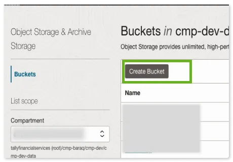
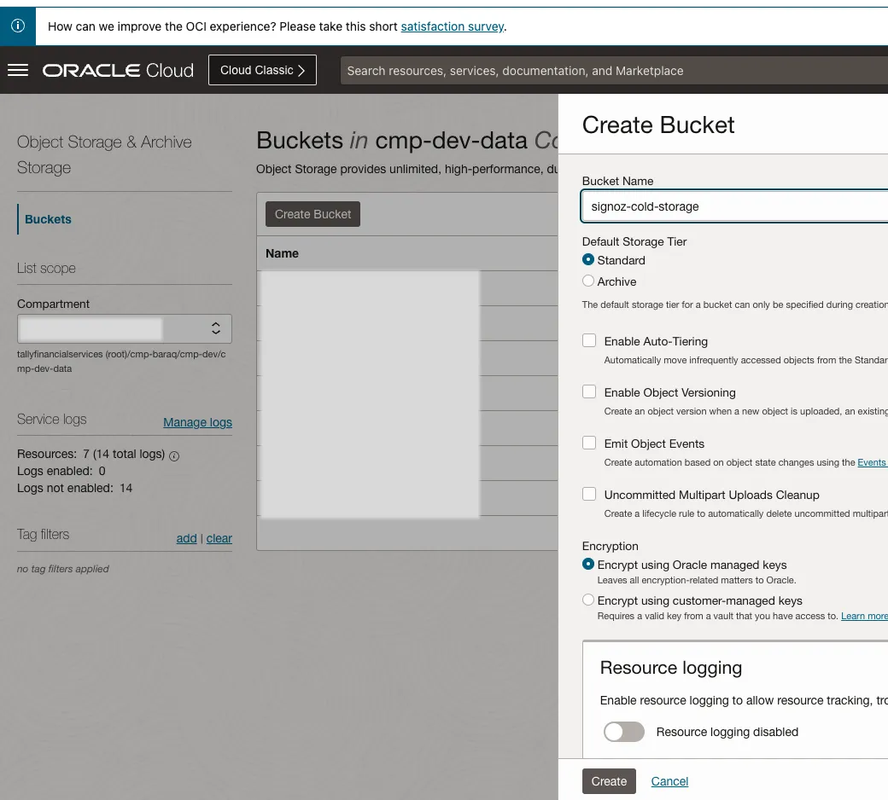

### Overview
In SigNoz, it's possible to customize the retention period for traces, logs, and metrics individually. Additionally, you have the option to specify the duration after which the data will be transferred to cold storage for traces, logs, and metrics. SigNoz seamlessly integrates with AWS S3 and GCP Google Storage buckets for this purpose.

This document will provide a step-by-step guide on how to integrate an OCI (Oracle Cloud) bucket as SigNoz's cold storage solution.
Given that [OCI buckets are S3-compatible](https://docs.oracle.com/en-us/iaas/Content/Object/Tasks/s3compatibleapi.htm), we will leverage this feature for the integration.

### Prerequisites

- SigNoz application up and running
- Helm version 3.8 or above
- SigNoz latest helm chart version
- Oracle Cloud Login Access
- SigNoz helm custom overwrite-values.yaml

Instruction to set retention period with cold storage (S3) can be found
in the [rention period userguide](https://signoz.io/docs/userguide/retention-period/).

### Steps To Integrate OCI Bucket As Cold Storage
1. Create OCI Bucket.
   a. Login to OCI cloud and Menu –> Storage–>Object Storage.
      
   b. Select the OCI compartment and click on **Create Bucket**.
      
   c. On the OCI bucket create page, give a meaningful name like signoz-archive-data. I have also selected Auto Tiering to bring down the costs of my bucket for OCI to move infrequently used objects to lower-tiered storage.
      

2. Generate custome OCI IAM secret key that will be utilized for accessing the Object Storage.
   a. Login to OCI cloud and go to the IAM user profile.
      
   b. Click on Customer Secret Keys and then Generate Secret Key. Copy the access key and secret key.
      

3. Update the helm **overwrite-values.yaml** to configure OCI bucket as cold storage

```yaml
clickhouse:
  # Cold storage configuration
  coldStorage:
    # -- Whether to enable cold storage
    enabled: true
    # -- Reserve free space on default disk (in bytes)
    # Default value is 10MiB
    defaultKeepFreeSpaceBytes: "10485760"
    # -- Type of cold storage: s3
    type: s3
    # -- Endpoint
    endpoint: https://<*********>.compat.objectstorage.<*******>.oraclecloud.com/<**********>/data/
    # -- OCI Access Key
    accessKey: ********************************
    # -- OCI Secret Access Key
    secretAccess: ********************************   
  persistence:
    enabled: true  
    size: 100Gi
```
`endpoint` would look something like `https://<OCI-NAMESPACE>.compat.objectstorage.<OCI REGION>.oraclecloud.com/<OCI BUCKET NAME>/data`

4. Upgrade the helm deployment.

```bash
helm --namespace platform upgrade my-release signoz/signoz -f overwrite-values.yaml    
```

:::info
Please customize the names of OCI resources, helm release, and namespaces to align with your specific requirements.    
:::
