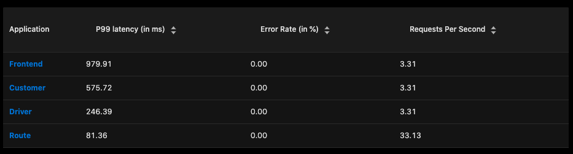
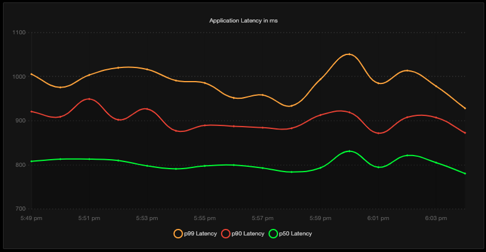
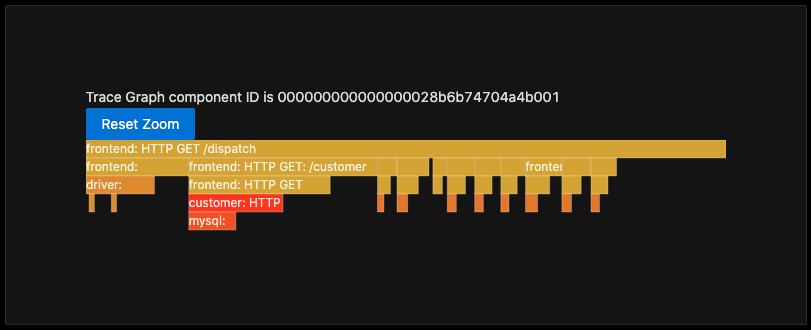
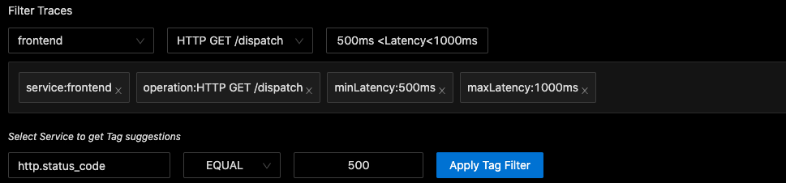
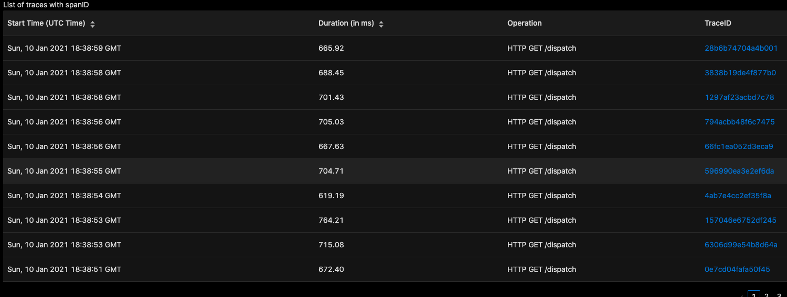
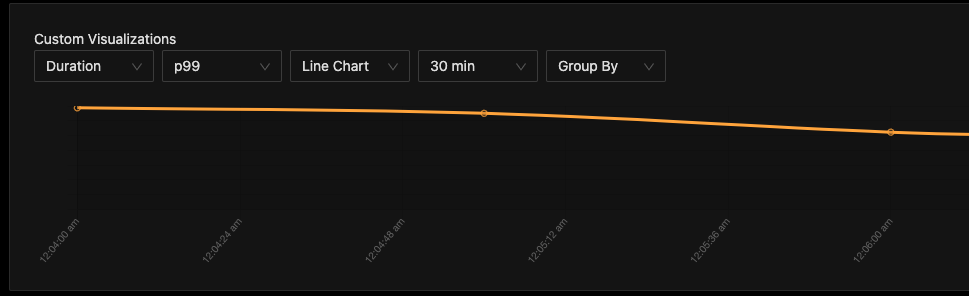
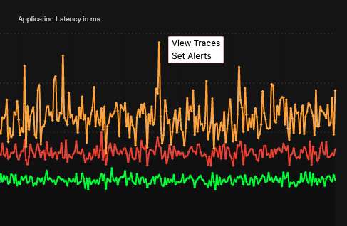

### List of all Applications with RED metrics

Get overview of all applications running with metrics like 99th percentile latency, error rate and requests per second.

### Application Performance metrics

1. 50th, 90th and 99th percentile latencies of every application
   
2. Requests per second (RPS) and Error Rate
3. Find slow endpoints of your application
   
4. Check health of external services this application depends on (Coming Soon ...)

### Distributed Tracing

See exact request trace to figure out issues in downstream services, slow DB queries, call to 3rd party services like payment gateways, etc. View all services, operations and tags as a request goes through multiple services and dependencies.

#### Advanced Trace Filtering

Filter by service name, operation, tags and duration of spans

The results of filtering:

#### Plot aggregates/metrics on filtered traces

Eg, you can filter traces with tag `customer: gold` and get 99th percentile latency experienced by them

#### Jump from Metrics to Traces

If you find any anomaly in the metrics of an application, you can click on it to view traces of that service in that timestamp. These traces will help you debug the reasons for that anomaly

#### In-built workflows (Coming Soon)

In-built workflows to reduce your efforts in detecting common issues like new deployment failures, 3rd party slow APIs, etc

#### Anomaly Detection Framework (Coming Soon)