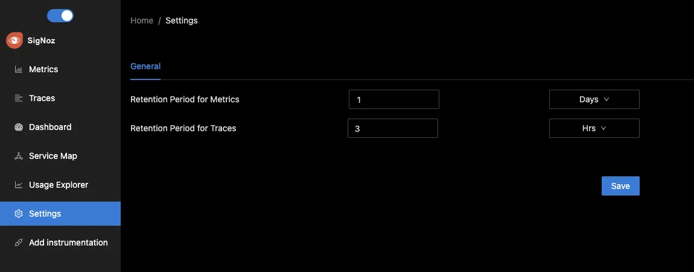

To set retention period for metrics and traces, you can go to settings page and change it.

- You can select independent rentention period for traces and metrics.
- Click `Save` to save the new retention period after making changes to change the retention period.

